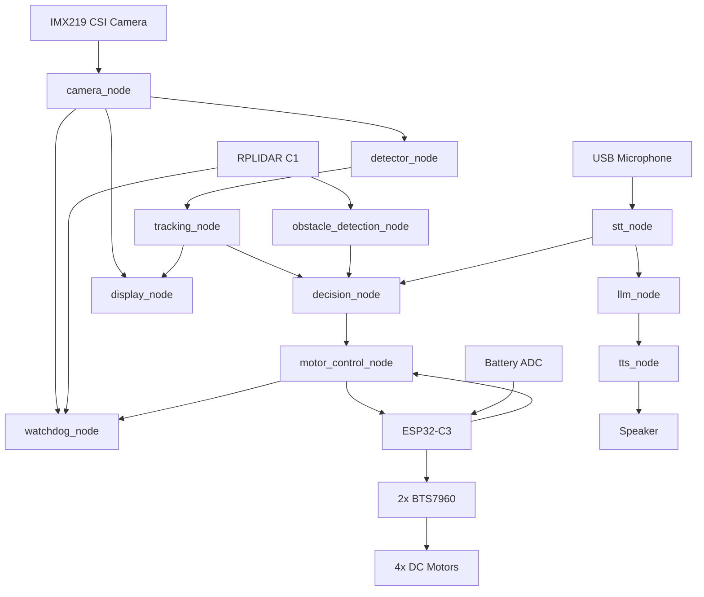

# Autonomous Mobile Robot — ROS 2 + Jetson Orin Nano

A complete indoor Autonomous Mobile Robot (AMR) built using **ROS 2 Humble**, **NVIDIA Jetson Orin Nano**, real-time computer vision, LiDAR-based obstacle avoidance, person tracking and following, voice interaction, LLM integration, motor control, battery monitoring, and safety supervision.

The robot can autonomously explore an indoor environment, detect and follow a person while maintaining distance, avoid nearby obstacles, respond to spoken commands, describe what it sees, and interact conversationally using an LLM.

---

## Project Overview

This project started as a ROS 2 learning exercise and progressively evolved into a complete physical robot.

The final system combines:

* Real-time camera perception
* YOLOv8 object detection
* Multi-object tracking
* RPLIDAR-based obstacle detection
* Reactive autonomous navigation
* Person following
* Search/exploration behaviour
* ESP32 motor control
* Battery monitoring
* Watchdog safety monitoring
* Wake-word detection
* Speech-to-Text
* LLM-based interaction
* Text-to-Speech
* Web-based camera/UI support

The robot runs its high-level perception, decision-making and interaction stack on the **Jetson Orin Nano**, while an **ESP32-C3** handles low-level motor actuation and battery sensing.

> This project currently uses reactive autonomous navigation rather than SLAM/Nav2-based map navigation.

---

# Key Capabilities

### Perception

* IMX219 CSI camera
* Real-time ROS 2 image publishing
* YOLOv8n TensorRT inference
* 25+ FPS detection pipeline
* Approximately 25–40 ms detector latency
* Object tracking across frames
* Person detection and tracking

### Autonomous Behaviour

* Follow a detected person
* Maintain distance from the target
* Stop when the person is too close
* Search the room when no person is visible
* Reacquire a person automatically
* Detect obstacles using LiDAR
* Compare left/right free space
* Turn toward the safer direction
* Stop when an obstacle is dangerously close

### Human-Robot Interaction

* Wake word detection
* Voice commands
* Whisper-based Speech-to-Text
* NVIDIA NIM API LLM integration
* Scene description
* Conversational responses
* Piper-based Text-to-Speech
* Voice-triggered follow mode

### Robot Monitoring & Safety

* Battery voltage monitoring
* ESP32 ADC measurement
* Battery percentage publishing
* Sensor/watchdog monitoring
* Emergency stop support
* Camera and LiDAR health supervision

---

# System Architecture



---

# Robot Behaviour

## Person Detected — Follow Mode

When a person is detected, the robot tracks the target and attempts to keep the person near the center of the camera frame.

```text
Person Detected
       │
       ▼
Track Target
       │
       ▼
Check Horizontal Position
       │
       ├── Left  → Turn Left
       ├── Right → Turn Right
       └── Center
              │
              ▼
       Check Target Distance
              │
       ┌──────┴──────┐
       │             │
   Safe Distance   Too Close
       │             │
       ▼             ▼
 Follow Target      STOP
```

Target distance is currently approximated using the width of the detected person's bounding box.

---

## No Person Detected — Search Mode

If no person is visible, the robot enters autonomous search behaviour.

```text
No Person Detected
        │
        ▼
    Search Mode
        │
        ▼
Move Through Room
        │
        ▼
Check For Obstacles
        │
        ├── Clear → Continue Exploring
        │
        └── Blocked → Avoid Obstacle
                         │
                         ▼
                    Continue Search
                         │
                         ▼
                   Person Detected
```

The robot moves through the room while continuously running camera detection and LiDAR obstacle monitoring.

---

## Obstacle Avoidance

The RPLIDAR continuously monitors the area in front of the robot.

When an obstacle enters the configured safety region:

```text
Obstacle Detected
       │
       ▼
      STOP
       │
       ▼
Evaluate LiDAR
       │
       ├──────────────┐
       ▼              ▼
Left Distance    Right Distance
       │              │
       └──────┬───────┘
              ▼
      Choose Clearer Side
              │
              ▼
           Turn
              │
              ▼
       Continue Movement
```

Obstacle avoidance has higher priority than normal person-following or search behaviour.

---

# Behaviour Priority

```text
Safety / Emergency Stop
          ↓
Obstacle Avoidance
          ↓
Voice / Manual Command
          ↓
Person Following
          ↓
Search / Exploration
```

This prevents perception or interaction behaviours from overriding critical safety actions.

---

# ROS 2 Packages

The final robot workspace is divided into focused ROS 2 packages.

## `perception_pkg`

Handles environmental perception.

### Nodes

#### `camera_node.py`

Captures frames from the IMX219 CSI camera using a Jetson GStreamer pipeline.

Publishes:

```text
/camera/image_raw
/camera/image_compressed
/camera/camera_info
```

Current camera pipeline:

* Camera capture: 1920 × 1080 @ 30 FPS
* Processing/output: 640 × 480
* GStreamer `nvarguscamerasrc`
* BEST_EFFORT image QoS
* Queue depth: 1

---

#### `detector_node.py`

Runs object detection using an optimized YOLOv8n TensorRT engine.

Model:

```text
yolov8n.engine
```

Current configuration:

```text
Input Size       : 640
Confidence       : 0.60
Inference        : TensorRT / CUDA
Performance      : 25+ FPS
Detector Latency : ~25–40 ms
```

Publishes:

```text
/detections
```

The detector was progressively optimized to reduce unnecessary processing and memory overhead while maintaining real-time performance on the Jetson.

---

#### `tracking_node.py`

Tracks detected objects across consecutive frames.

The tracker uses:

* Kalman filtering
* Detection association
* Hungarian assignment
* Persistent track IDs

Publishes:

```text
/tracked_detections
```

The decision system primarily uses tracked person detections for following behaviour.

---

#### `obstacle_detection_node.py`

Processes data from the RPLIDAR C1.

Subscribes:

```text
/scan
```

Publishes:

```text
/obstacle_detected
/front_distance
/free_direction
```

Responsibilities:

* Monitor the front safety region
* Detect nearby obstacles
* Estimate minimum front distance
* Compare free space on the left and right
* Recommend a safe direction

Typical configuration:

```text
Obstacle Threshold : ~0.50 m
Front Scan Region  : ~±20°
```

---

# `control_pkg`

Handles robot behaviour, movement, safety and visualization.

## `decision_node.py`

The central behaviour controller of the robot.

Inputs include:

```text
/tracked_detections
/obstacle_detected
/front_distance
/free_direction
/voice_command
```

Output:

```text
/cmd_vel
```

Responsibilities:

* Person following
* Distance keeping
* Target centering
* Target-loss handling
* Search/exploration
* Obstacle avoidance
* Voice-command handling
* Manual control
* Stop/pause behaviour

Current behaviour tuning includes approximately:

```text
Frame Width       : 640 px
Frame Center      : 320 px
Turn Threshold    : ±60 px
Person Stop Width : ~450 px
Target Timeout    : ~2 seconds
```

---

## `motor_control_node.py`

Acts as the bridge between ROS 2 movement commands and the ESP32-C3.

Subscribes:

```text
/cmd_vel
```

Communicates with the ESP32 using serial communication.

Typical serial configuration:

```text
Device    : /dev/ttyACM0
Baud Rate : 115200
```

Motor commands are converted into left/right PWM values.

Example protocol:

```text
left_pwm,right_pwm
```

Range:

```text
-255 to +255
```

The same node also receives battery telemetry from the ESP32 and publishes:

```text
/battery_status
```

---

## `display_node.py`

Handles visualization of the perception output.

Responsibilities include:

* Display camera frames
* Draw detections
* Draw tracked objects
* Show track IDs
* Provide visual debugging information

---

## `watchdog_node.py`

Safety monitoring layer for the robot.

Monitors critical signals such as:

```text
/scan
/camera/image_raw
/obstacle_detected
/front_distance
/battery_status
/cmd_vel
```

Publishes:

```text
/safety_stop
```

Its purpose is to stop or inhibit robot movement when critical sensors or control signals become unsafe or unavailable.

Final safety thresholds and failure handling can be tuned independently of the main decision logic.

---

# `interaction_pkg`

Handles voice and conversational interaction.

## `stt_node.py`

Speech-to-Text and wake-word processing.

Responsibilities:

* Continuously monitor microphone input
* Detect the wake word
* Capture commands
* Perform Whisper-based speech recognition
* Publish voice commands

Wake word:

```text
Vector
```

Example commands:

```text
Vector, follow me
Vector, stop
Vector, move forward
Vector, turn left
Vector, turn right
Vector, what do you see?
Vector, what is the battery status?
```

The wake word can also immediately pause/stop autonomous movement before processing the requested interaction.

---

## `llm_node.py`

Provides natural-language understanding and conversational responses using the NVIDIA NIM API.

Responsibilities:

* Process conversational queries
* Interpret scene-related questions
* Generate natural responses
* Use robot/perception context where required

Example:

```text
User:
"What do you see?"

Robot:
"I can see a person in front of me..."
```

Sensitive credentials are loaded through environment configuration and are not stored directly in source code.

---

## `tts_node.py`

Converts generated responses into speech.

Responsibilities:

* Speech synthesis
* Audio playback
* Fast acknowledgement
* Spoken robot responses

The current implementation uses Piper-based speech synthesis for local TTS.

---

# Interaction Architecture

```text
                     ┌─────────────────┐
                     │   Microphone    │
                     └────────┬────────┘
                              │
                              ▼
                     ┌─────────────────┐
                     │    STT Node     │
                     │     Whisper     │
                     └────────┬────────┘
                              │
                 ┌────────────┴────────────┐
                 │                         │
                 ▼                         ▼
        Robot Voice Command             LLM Query
                 │                         │
                 ▼                         ▼
        ┌────────────────┐        ┌────────────────┐
        │ Decision Node  │        │    LLM Node    │
        └────────────────┘        │  NVIDIA NIM    │
                                  └────────┬───────┘
                                           │
                                           ▼
                                  ┌────────────────┐
                                  │    TTS Node    │
                                  └────────┬───────┘
                                           │
                                           ▼
                                      Speaker
```

---

# Follow-Me Voice Mode

A spoken command can directly change autonomous behaviour.

```text
"Vector"
    │
    ▼
Wake Word Detected
    │
    ▼
"Follow me"
    │
    ▼
Voice Command
    │
    ▼
Decision Node
    │
    ▼
FOLLOW Mode
    │
    ▼
Find / Track Person
    │
    ▼
Follow + Maintain Distance
    │
    ▼
Avoid Obstacles When Required
```

---

# Scene Description

The interaction system allows the robot to answer questions about its environment.

Example:

```text
User:
"Vector, what do you see?"

Robot:
"I can see a person in front of me."
```

This combines the robot's perception information with natural-language generation.

---

# LiDAR

The robot uses an **RPLIDAR C1** for 2D environmental sensing.

ROS topic:

```text
/scan
```

The LiDAR currently supports reactive navigation rather than map-based SLAM.

Its main responsibilities in this project are:

* Front obstacle detection
* Safety distance monitoring
* Left/right clearance comparison
* Obstacle avoidance

---

# Battery Monitoring

Battery voltage is monitored using the ESP32-C3 ADC.

## Voltage Divider

```text
Battery +
   │
 100 kΩ
   │
   ├──────── GPIO1 / ADC
   │
 33 kΩ
   │
Battery -
```

Hardware:

```text
R1 : 100 kΩ
R2 : 33 kΩ
ADC: ESP32-C3 GPIO1
```

The ESP32 measures the divided voltage and sends battery information to the Jetson through the existing serial connection.

The `motor_control_node` processes this information and publishes the robot's battery status.

---

# Hardware

| Component        | Hardware                                     |
| ---------------- | -------------------------------------------- |
| Main Computer    | NVIDIA Jetson Orin Nano Developer Kit — 8 GB |
| Camera           | Waveshare IMX219-120 CSI Camera — 120° FOV   |
| LiDAR            | SLAMTEC RPLIDAR C1                           |
| Microcontroller  | ESP32-C3 Super Mini                          |
| Motor Drivers    | 2 × BTS7960 43 A H-Bridge                    |
| Motors           | 4 × Johnson 12 V 100 RPM DC Geared Motors    |
| Chassis          | 4WD Metal Robot Chassis                      |
| Battery          | 11.1 V 6000 mAh 3S2P Li-ion                  |
| Power Regulation | XL4015 5 A DC-DC Buck Converter              |
| Microphone       | USB PnP Microphone                           |
| Speaker          | Bluetooth Speaker                            |

---

# Software Stack

| Layer                 | Technology                           |
| --------------------- | ------------------------------------ |
| Robotics Middleware   | ROS 2 Humble                         |
| Operating Environment | Ubuntu / JetPack                     |
| Jetson Platform       | L4T R36.x                            |
| GPU Stack             | CUDA 12.6                            |
| Containerization      | Docker + NVIDIA Runtime              |
| Jetson Container      | Dusty-NV L4T PyTorch                 |
| Computer Vision       | OpenCV                               |
| Object Detection      | YOLOv8n                              |
| Inference Runtime     | TensorRT                             |
| Tracking              | Kalman Filter + Hungarian Assignment |
| LiDAR                 | RPLIDAR ROS 2 Driver                 |
| STT                   | Whisper                              |
| LLM                   | NVIDIA NIM API                       |
| Local LLM Development | Ollama / TinyLlama                   |
| TTS                   | Piper                                |
| MCU Firmware          | ESP32 / Arduino framework            |
| Web Streaming         | web_video_server                     |

---

# Repository Structure

The current workspace is organized as:

```text
my_robot/
│
├── config/
│
├── firmware/
│   └── ESP32 motor + battery firmware
│
├── models/
|   |
│   ├── piper/
│   │   ├── en_US-hfc_female-medium.onnx/
│   │   └── en_US-hfc_male-medium.onnx/
|   └── vision/
|       ├── yolov8n.engine/
│       └── yolov8n-pose.engine/
│
├── robot_ui/
│
├── src/
│   │
│   ├── control_pkg/
│   │   ├── control_pkg/
│   │   │   ├── decision_node.py
│   │   │   ├── display_node.py
│   │   │   ├── motor_control_node.py
│   │   │   └── watchdog_node.py
│   │   ├── launch/
│   │   ├── resource/
│   │   ├── test/
│   │   ├── package.xml
│   │   └── setup.cfg
│   │
│   ├── interaction_pkg/
│   │   ├── interaction_pkg/
│   │   │   ├── llm_node.py
│   │   │   ├── stt_node.py
│   │   │   └── tts_node.py
│   │   ├── launch/
│   │   ├── resource/
│   │   ├── package.xml
│   │   ├── setup.cfg
│   │   └── setup.py
│   │
│   ├── perception_pkg/
│   │   ├── perception_pkg/
│   │   │   ├── camera_node.py
│   │   │   ├── detector_node.py
│   │   │   ├── obstacle_detection_node.py
│   │   │   └── tracking_node.py
│   │   ├── launch/
│   │   ├── resource/
│   │   ├── test/
│   │   ├── package.xml
│   │   └── setup.cfg
│   │
│   ├── robot_bringup/
│   ├── robot_interfaces/
│   ├── rplidar_ros/
│   └── web_video_server/
│
├── .env
├── .gitignore
├── installed_packages.txt
├── requirements.txt
├── start_robot.sh
└── README.md
```

The generated ROS 2 directories:

```text
build/
install/
log/
```

are local build artifacts and should normally remain excluded from Git.

---

# Package Responsibilities

| Package            | Responsibility                                            |
| ------------------ | --------------------------------------------------------- |
| `perception_pkg`   | Camera, detection, tracking and LiDAR obstacle processing |
| `control_pkg`      | Decision making, motor control, display and safety        |
| `interaction_pkg`  | STT, LLM and TTS                                          |
| `robot_bringup`    | Full-system startup                                       |
| `robot_interfaces` | Custom ROS 2 interfaces                                   |
| `rplidar_ros`      | RPLIDAR C1 ROS 2 driver                                   |
| `web_video_server` | Browser-accessible image streaming                        |

---

# Important ROS 2 Topics

| Topic                      | Producer           | Consumer / Purpose             |
| -------------------------- | ------------------ | ------------------------------ |
| `/camera/image_raw`        | Camera             | Detector, display, watchdog    |
| `/camera/image_compressed` | Camera             | Streaming / visualization      |
| `/camera/camera_info`      | Camera             | Camera calibration information |
| `/detections`              | Detector           | Tracker                        |
| `/tracked_detections`      | Tracker            | Decision                       |
| `/scan`                    | RPLIDAR            | Obstacle detection, watchdog   |
| `/obstacle_detected`       | Obstacle Detection | Decision, watchdog             |
| `/front_distance`          | Obstacle Detection | Decision, watchdog             |
| `/free_direction`          | Obstacle Detection | Decision                       |
| `/voice_command`           | STT                | Decision / interaction         |
| `/cmd_vel`                 | Decision           | Motor control                  |
| `/battery_status`          | Motor Control      | Robot monitoring               |
| `/safety_stop`             | Watchdog           | Safety layer                   |

---

# Build

Clone the repository and enter the workspace:

```bash
git clone https://github.com/swarghane/Autonomous_Mobile_Robot
cd my_robot
```

Install Python dependencies:

```bash
pip3 install -r requirements.txt
```

Build the ROS 2 workspace:

```bash
colcon build --symlink-install
```

Source the workspace:

```bash
source install/setup.bash
```

---

# Running the Robot

The main startup entry point is:

```bash
chmod +x start_robot.sh
./start_robot.sh
```

The repository also contains the `robot_bringup` package for launching the complete ROS 2 system.

Before starting the robot, verify that the required hardware is connected:

```bash
ls /dev/ttyACM*
ls /dev/ttyUSB*
```

Typical hardware interfaces include:

```text
ESP32-C3   → /dev/ttyACM0
RPLIDAR    → USB serial interface
IMX219     → CSI
USB Mic    → ALSA / PipeWire audio device
```

Actual device names may vary between systems.

---

# Environment Configuration

API keys and machine-specific configuration should not be committed directly to source code.

Store sensitive configuration inside:

```text
.env
```

and ensure `.env` remains in:

```text
.gitignore
```

Example configuration:

```text
NVIDIA_API_KEY=<your-key>
```

Never commit real API keys or credentials to GitHub.

---

# Performance

Current optimized perception performance on the Jetson Orin Nano:

| Metric               |    Result |
| -------------------- | --------: |
| Camera Target FPS    |    30 FPS |
| Detection Throughput |   25+ FPS |
| Detector Latency     | ~25–40 ms |
| Detector             |   YOLOv8n |
| Inference            |  TensorRT |
| Input Size           | 640 × 640 |

The detector node uses a TensorRT `.engine` model to take advantage of the Jetson GPU.

---

# Safety

Physical mobile robots should not depend on perception alone for safety.

This project includes several software-level safety mechanisms:

* Immediate stop near obstacles
* Stop when the followed person becomes too close
* Target-loss handling
* Sensor watchdog monitoring
* `/safety_stop`
* Zero-velocity command on shutdown
* Battery monitoring

A physical hardware emergency-stop circuit is recommended for operation outside controlled testing environments.

---

# Development Journey

The final AMR was developed incrementally through separate learning phases.

### Phase 1 — ROS 2 Fundamentals

* Ubuntu on WSL2
* ROS 2 Humble
* Nodes
* Topics
* Services
* Publisher/subscriber communication

### Phase 2 — Perception Development

* USB camera on WSL
* Camera nodes
* YOLOv8
* Detection pipeline
* Display nodes
* TF
* RViz2
* ONNX experimentation

### Phase 3 — Jetson Deployment

* Jetson Orin Nano
* IMX219 CSI camera
* CUDA
* PyTorch
* Dusty-NV Docker container
* TensorRT `.engine`

### Phase 4 — Mobility

* ESP32-C3
* Motor drivers
* DC motors
* Serial communication
* Decision node
* Motor control

### Phase 5 — Autonomous Behaviour

* RPLIDAR C1
* Obstacle detection
* Person following
* Search behaviour
* Reactive obstacle avoidance
* Detector optimization
* Battery monitoring

### Phase 6 — Human-Robot Interaction

* Wake word
* Whisper STT
* Local Ollama experiments
* NVIDIA NIM
* TTS experiments
* Voice commands
* Scene description
* Interaction-system optimization

The phase repositories preserve the development and experimentation history, while this repository contains the final integrated robot.

---

# Design Philosophy

The system intentionally separates responsibilities between ROS 2 nodes:

```text
Perception
     ↓
World Understanding
     ↓
Decision Making
     ↓
Motion Control
```

Human interaction runs alongside this pipeline:

```text
Speech
   ↓
Understanding
   ↓
Robot Command / Conversation
```

Low-level hardware control remains isolated on the ESP32:

```text
Jetson
   ↓ Serial
ESP32
   ↓
Motor Drivers
   ↓
Motors
```

This separation makes individual components easier to test, replace and optimize without rewriting the complete robot stack.

---

# Future Improvements

Possible future extensions include:

* Hardware emergency-stop switch
* Wheel encoders and closed-loop velocity control
* Odometry
* IMU integration
* SLAM
* Nav2
* Map-based autonomous navigation
* Improved multi-person target selection
* Re-identification after long target loss
* Better battery-state estimation
* Longer autonomous runtime testing
* GPU-accelerated speech components
* More capable local LLM deployment

---

# Project Scope

This robot is intended as an **AI robotics and autonomous mobile robot development platform** demonstrating the integration of:

* Embedded systems
* ROS 2
* Computer vision
* Edge AI
* TensorRT
* Sensor processing
* Autonomous behaviour
* Human-Robot Interaction
* Large Language Models
* Hardware/software integration

The focus of the project is not a single algorithm, but the design and integration of a complete perception-to-action robotic system running on real hardware.

---

## Final System

```text
See
 ↓
Understand
 ↓
Decide
 ↓
Move
 ↓
Avoid
 ↓
Listen
 ↓
Respond
```

A complete autonomous mobile robot built from the ground up around ROS 2 and NVIDIA Jetson.
