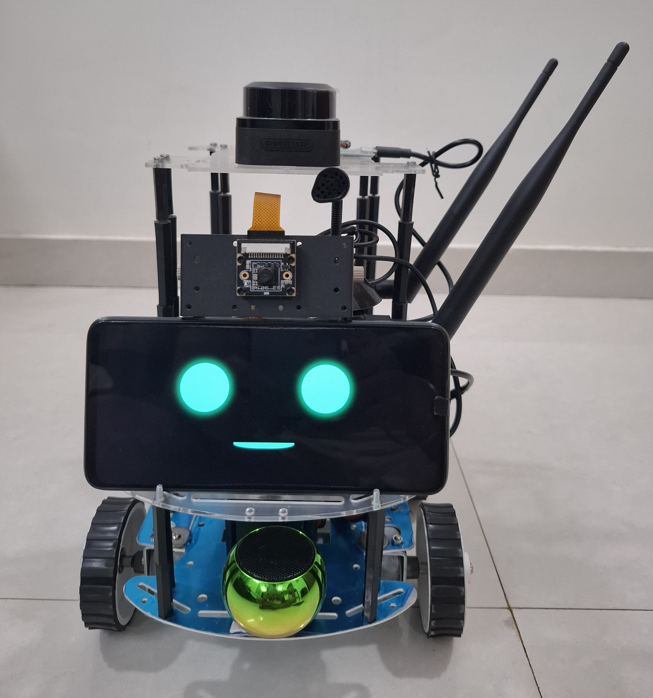
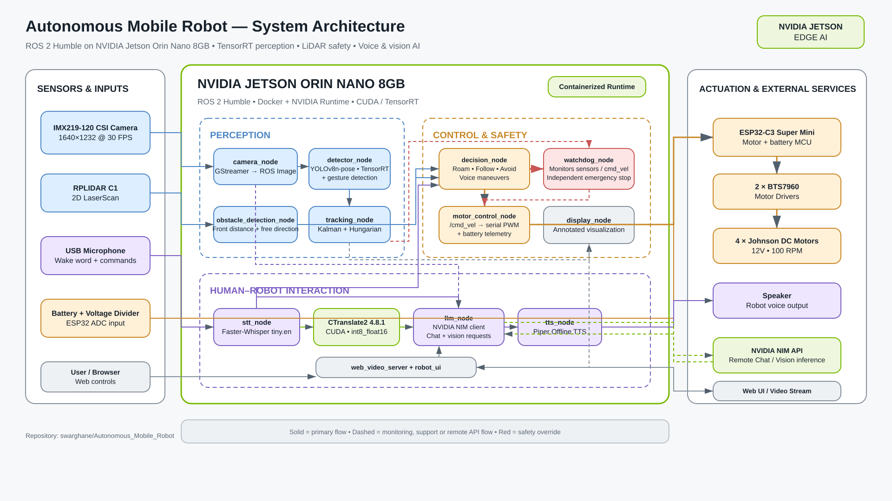
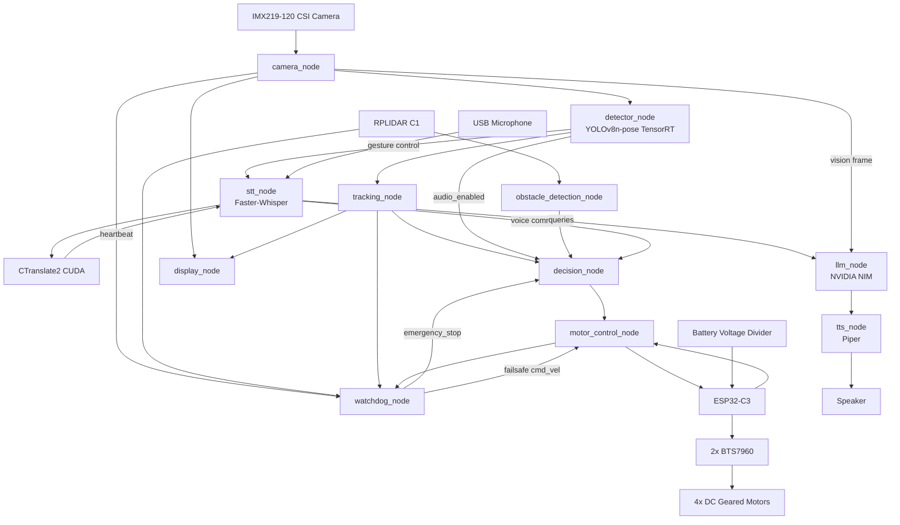
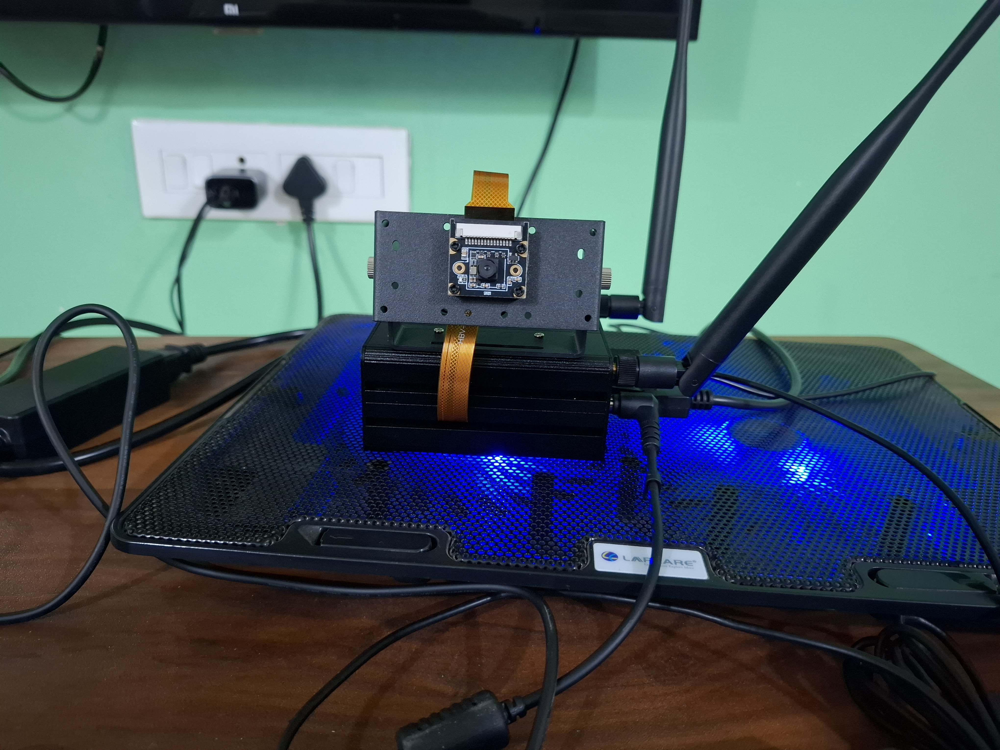
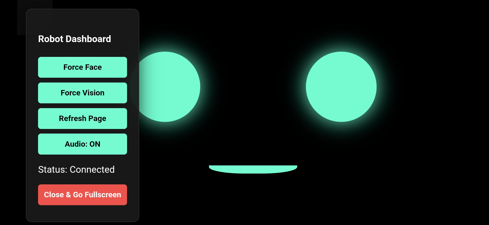
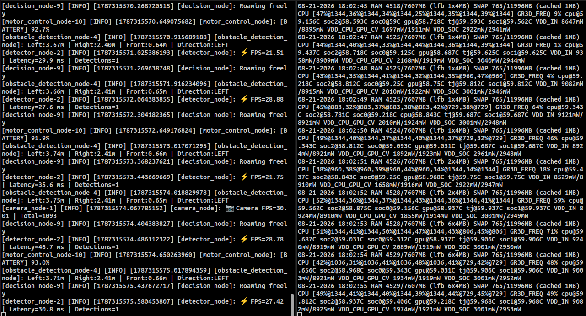

# Autonomous Mobile Robot — ROS 2 + NVIDIA Jetson Orin Nano

A complete indoor **Autonomous Mobile Robot (AMR)** built around **ROS 2 Humble** and the **NVIDIA Jetson Orin Nano 8GB*, combining real-time TensorRT perception, person tracking and following, LiDAR-based obstacle avoidance, autonomous exploration, voice interaction, vision-language interaction, motor control, battery monitoring, hand-gesture control, a web interface, and an independent safety watchdog.

The robot performs its high-level perception, autonomous behaviour, interaction, and safety processing on the **Jetson Orin Nano**, while an **ESP32-C3** handles low-level motor actuation and battery sensing.

<p align="center">
  
</p>

> The current system uses **reactive autonomous navigation** rather than SLAM/Nav2-based map navigation.

---

# Demo

🎥 **Full AMR Demonstration:** [Watch on YouTube] https://youtu.be/16Se3gCuTcY

The demonstration includes:

- Autonomous movement
- Person following
- Person search and reacquisition
- LiDAR obstacle avoidance
- Emergency obstacle stop
- Voice commands
- 1 m forward/backward voice maneuvers
- Vision-language interaction
- Battery-status interaction
- Hand-gesture control
- Robot web interface
- NVIDIA Jetson Orin Nano hardware
- Real-time Jetson `tegrastats`

---

# Project Overview

This project began as a ROS 2 learning exercise and progressively evolved into a complete physical autonomous robot.

The final system integrates:

- NVIDIA Jetson edge computing
- ROS 2 distributed robotics architecture
- IMX219 CSI camera
- YOLOv8 Pose TensorRT inference
- Multi-object tracking
- Hand-gesture recognition
- RPLIDAR C1 sensing
- Reactive obstacle avoidance
- Person following
- Autonomous search behaviour
- Watchdog emergency stopping
- ESP32 motor control
- Battery monitoring
- Faster-Whisper Speech-to-Text
- GPU-enabled CTranslate2
- NVIDIA NIM LLM integration
- NVIDIA NIM vision-language interaction
- Piper Text-to-Speech
- Browser-based robot interface

The focus of the project is not a single AI model or algorithm, but the integration of a complete **perception → decision → action → interaction** robotics system running on real hardware.

---

# Key Capabilities

## Perception

- Waveshare IMX219-120 CSI camera
- 1640 × 1232 camera capture at 30 FPS
- 640 × 480 ROS processing stream
- YOLOv8n-pose TensorRT inference
- GPU-accelerated detection
- Multi-object tracking
- Person tracking
- Human pose keypoints
- Left/right raised-hand gesture detection
- Camera heartbeat and automatic reconnect support

## Autonomous Behaviour

- Autonomous indoor roaming
- Person-following mode
- Target centering
- Target-distance approximation using bounding-box width
- Temporary target-loss handling
- Automatic target reacquisition
- LiDAR-based obstacle detection
- Left/right clearance comparison
- Obstacle-direction locking to prevent rapid turn-direction switching
- Reactive obstacle avoidance
- Timed forward/backward and turn maneuvers

## Human-Robot Interaction

- Wake word: **Vector**
- Faster-Whisper Speech-to-Text
- CUDA-based CTranslate2 execution
- Voice movement commands
- Follow commands
- Battery-status queries
- NVIDIA NIM conversational LLM
- NVIDIA NIM vision-language model
- Scene description
- Piper offline Text-to-Speech
- Web UI face/camera mode control

## Gesture Interaction

The YOLO pose detector also monitors raised-hand gestures.

Current gesture behaviour:

```text
Left hand raised
       ↓
Disable audio
       ↓
Robot automatically enters follow mode
```

```text
Right hand raised
       ↓
Re-enable audio
       ↓
Restore previous voice/autonomous state
```

The gesture must remain detected for a configured hold period before activation.

## Monitoring and Safety

- Independent ROS 2 watchdog node
- LiDAR critical-distance monitoring
- Camera heartbeat supervision
- LiDAR topic-liveness monitoring
- Detection topic-liveness monitoring
- `/cmd_vel` monitoring
- Battery warning and critical thresholds
- Spoken watchdog warnings
- `/emergency_stop` override
- Direct watchdog zero-velocity publishing
- Automatic emergency-stop release after faults clear

---

# System Architecture

<p align="center">
  
</p>



---

# Robot Behaviour

## Default Autonomous Mode

The decision node starts in:

```text
AUTO / ROAM
```

When follow mode is not enabled, the robot autonomously searches/explores the environment while continuously evaluating LiDAR obstacle information.

---

## Person Following

Follow mode can be activated by voice or gesture-related behaviour.

```text
Follow Mode Enabled
        │
        ▼
Detect Person
        │
        ▼
Track Target
        │
        ▼
Check Horizontal Error
        │
        ├── Person Left  → Turn Left
        ├── Person Right → Turn Right
        └── Centered
                │
                ▼
        Check Bounding-Box Width
                │
        ┌───────┴────────┐
        │                │
   Safe Distance      Too Close
        │                │
        ▼                ▼
     Follow             STOP
```

Current tuning includes approximately:

```text
Frame Width       : 640 px
Frame Center      : 320 px
Turn Threshold    : ±60 px
Person Stop Width : ~450 px
Target Timeout    : ~2 seconds
```

Distance to the followed person is currently approximated using detection bounding-box width rather than metric depth sensing.

---

## Search / Exploration

When autonomous operation is active and no followed person is available:

```text
No Target
   │
   ▼
Roam / Search
   │
   ▼
Check LiDAR
   │
   ├── Clear ─────► Continue
   │
   └── Obstacle
          │
          ▼
      Avoidance
          │
          ▼
     Resume Search
```

The perception pipeline continues running while the robot searches.

---

# Obstacle Detection and Avoidance

The **RPLIDAR C1** continuously monitors the robot's surroundings.

Current obstacle-detection defaults include:

```text
Obstacle Trigger Distance : 0.50 m
Obstacle Clear Distance   : 0.60 m
Front Region              : ±20°
Direction Deadband        : 0.30 m
Default Direction         : LEFT
```

The different trigger and clear distances provide **hysteresis**, helping prevent rapid obstacle-state oscillation near the threshold.

When an obstacle is first detected, the node determines the clearer direction and holds that avoidance direction while the obstacle remains active.

```text
Obstacle Detected
        │
        ▼
   Stop / Pause
        │
        ▼
Compare Left and Right Clearance
        │
        ▼
Choose Safer Direction
        │
        ▼
Lock Avoidance Direction
        │
        ▼
Turn / Avoid
        │
        ▼
Confirm Front Clear
        │
        ▼
Resume Operation
```

Obstacle avoidance takes priority over normal autonomous movement.

---

# Independent Watchdog Safety

The `watchdog_node` operates independently from the main obstacle-avoidance behaviour.

It monitors:

```text
/scan
/obstacle_detected
/tracked_detections
/camera/heartbeat
/cmd_vel
/battery_status
```

The watchdog publishes:

```text
/emergency_stop
```

and can also publish a zero `Twist` directly to `/cmd_vel`.

Current critical LiDAR defaults:

```text
Critical Distance       : 0.28 m
Critical Clear Distance : 0.35 m
Forward Safety Cone     : ±25°
Forward Motion Minimum  : 0.05 m/s
```

When the robot is moving forward and an object enters the critical region:

```text
Critical Obstacle
       │
       ▼
Watchdog Fault
       │
       ├── Spoken warning
       ├── /emergency_stop = True
       └── Zero /cmd_vel
```

When every active watchdog fault clears:

```text
/emergency_stop = False
```

and normal operation can resume.

---

# Behaviour Priority

```text
Watchdog Emergency Stop
          ↓
Obstacle Avoidance
          ↓
Voice / Manual Maneuver
          ↓
Person Following
          ↓
Autonomous Search / Roam
```

Safety-related behaviour is designed to override normal movement.

---

# Voice Movement Commands

The decision node supports timed manual maneuvers.

Current defaults:

```text
Forward Distance    : 1.0 m
Backward Distance   : 1.0 m
Linear Speed        : 0.25 m/s

Turn Command        : ~90°
Turn Speed          : 0.6 rad/s
Measured Turn Rate  : 1.2 rad/s
```

These are currently **open-loop timed maneuvers**.

Without wheel encoders or odometry, the travelled distance and angle remain approximate and depend on battery voltage, floor surface, traction, motor loading, and mechanical behaviour.

---

# ROS 2 Packages

The workspace is divided into focused ROS 2 packages.

---

## `perception_pkg`

Handles camera perception, AI inference, tracking, gestures, and LiDAR obstacle processing.

### `camera_node.py`

Captures frames from the IMX219 CSI camera using NVIDIA GStreamer.

Default configuration:

```text
Camera Type     : CSI
Capture         : 1640 × 1232
Camera FPS      : 30
ROS Image       : 640 × 480
Sensor ID       : 0
GStreamer       : nvarguscamerasrc
Image QoS       : BEST_EFFORT
Queue Depth     : 1
```

Publishes:

```text
/camera/image_raw
/camera/image_compressed
/camera/camera_info
/camera/heartbeat
```

The node also includes automatic reconnect support after repeated frame-read failures.

---

### `detector_node.py`

Runs **YOLOv8n-pose** using a TensorRT engine.

Default model:

```text
/workspace/models/vision/yolov8n-pose.engine
```

Configuration:

```text
Input Size         : 640
Confidence         : 0.60
Runtime            : TensorRT / CUDA
Gesture Hold       : 1.0 s
Gesture Cooldown   : 5.0 s
```

Publishes:

```text
/detections
/audio_enabled
```

In addition to detections, pose keypoints are used to detect sustained raised-hand gestures.

---

### `tracking_node.py`

Tracks detections across frames using:

- Kalman filtering
- Detection association
- Hungarian assignment
- Persistent track IDs

Publishes:

```text
/tracked_detections
```

---

### `obstacle_detection_node.py`

Processes RPLIDAR scans.

Subscribes:

```text
/scan
```

Publishes:

```text
/obstacle_detected
/front_distance
/free_direction
```

Responsibilities:

- Front obstacle detection
- Minimum front-distance estimation
- Left/right clearance comparison
- Direction selection
- Obstacle-state hysteresis
- Avoidance-direction locking

---

# `control_pkg`

Handles autonomous behaviour, motor communication, visualization, and safety.

## `decision_node.py`

The central robot behaviour controller.

Inputs include:

```text
/tracked_detections
/obstacle_detected
/front_distance
/free_direction
/voice_command
/audio_enabled
/emergency_stop
```

Output:

```text
/cmd_vel
```

Responsibilities:

- Autonomous roaming
- Person following
- Target centering
- Target-loss handling
- Obstacle avoidance
- Voice control
- 1 m forward/backward maneuvers
- Approximate 90° turn maneuvers
- Gesture-related follow state
- Watchdog emergency-stop enforcement

---

## `motor_control_node.py`

Bridges ROS 2 movement commands and the ESP32-C3.

Subscribes:

```text
/cmd_vel
```

Typical serial configuration:

```text
Device    : /dev/ttyACM0
Baud Rate : 115200
```

Motor commands are converted to left/right PWM values:

```text
left_pwm,right_pwm
```

PWM range:

```text
-255 to +255
```

The same serial connection receives battery telemetry from the ESP32.

Publishes:

```text
/battery_status
```

---

## `display_node.py`

Provides local perception visualization including:

- Camera frames
- Detected objects
- Tracked objects
- Track IDs
- Debug information

---

## `watchdog_node.py`

Provides an independent safety-monitoring layer.

It monitors sensor and command liveness as well as immediate LiDAR collision risk and battery state.

Outputs include:

```text
/emergency_stop
/cmd_vel
/llm_response
/robot_emotion
```

The watchdog can therefore stop the robot independently of the main decision node.

---

# `interaction_pkg`

Handles speech and conversational interaction.

## `stt_node.py`

Speech recognition is implemented using **Faster-Whisper**.

Default configuration:

```text
Model        : tiny.en
Device       : cuda
Compute Type : int8_float16
Wake Word    : Vector
```

The node:

- Continuously monitors microphone input
- Detects the wake word
- Temporarily stops the robot on wake
- Captures the following command
- Transcribes speech
- Publishes normalized voice commands
- Mutes listening while TTS is active
- Supports audio enable/disable state

Examples:

```text
Vector, follow me
Vector, stop
Vector, move forward
Vector, move backward
Vector, turn left
Vector, turn right
Vector, what do you see?
Vector, what is your battery status?
```

---

## `llm_node.py`

Provides conversational and vision-language interaction through the **NVIDIA API**.

Current models:

```text
Chat Model:
meta/llama-3.1-8b-instruct

Vision Model:
meta/llama-3.2-11b-vision-instruct
```

The LLM node can:

- Answer conversational questions
- Report battery status
- Describe a current camera frame
- Identify visible people/paths/obstacles when clear
- Control robot UI modes
- Produce concise natural-language responses

The current vision request is resized to a maximum dimension of:

```text
640 px
```

before being JPEG encoded and sent to the NVIDIA vision model.

Credentials are loaded from:

```text
/workspace/.env
```

and are not stored directly in source code.

---

## `tts_node.py`

The current TTS implementation uses **Piper** for local offline speech synthesis.

Supported voices include:

```text
en_US-hfc_female-medium
en_US-hfc_male-medium
```

Default voice:

```text
en_US-hfc_female-medium
```

The node also supports:

- Persistent audio playback
- TTS status publishing
- Voice profiles
- Volume control
- Lip-sync/mouth animation signals
- Bluetooth-audio keepalive behaviour

Piper TTS currently runs on the CPU.

---

# Interaction Architecture

```text
                    USB Microphone
                          │
                          ▼
                ┌─────────────────┐
                │     STT Node    │
                │ Faster-Whisper  │
                └────────┬────────┘
                         │
              CTranslate2 / CUDA
                         │
          ┌──────────────┴──────────────┐
          │                             │
          ▼                             ▼
   Robot Command                    LLM Query
          │                             │
          ▼                             ▼
 ┌────────────────┐          ┌──────────────────┐
 │ Decision Node  │          │   NVIDIA NIM     │
 └────────────────┘          │ Chat / Vision    │
                             └────────┬─────────┘
                                      │
                                      ▼
                             ┌─────────────────┐
                             │    Piper TTS    │
                             └────────┬────────┘
                                      │
                                      ▼
                                   Speaker
```

---

# LiDAR

The robot uses a **SLAMTEC RPLIDAR C1** for 2D environmental sensing.

ROS topic:

```text
/scan
```

The LiDAR currently supports:

- Reactive obstacle detection
- Minimum front-distance monitoring
- Left/right clearance comparison
- Obstacle avoidance
- Independent watchdog collision detection

The project currently does not use LiDAR for SLAM or map-based navigation.

---

# Battery Monitoring

Battery voltage is measured through an ESP32-C3 ADC.

## Voltage Divider

```text
Battery +
   │
 100 kΩ
   │
   ├──────── GPIO1 / ADC
   │
  33 kΩ
   │
Battery -
```

Hardware:

```text
R1  : 100 kΩ
R2  : 33 kΩ
ADC : ESP32-C3 GPIO1
```

The ESP32 sends battery information to the Jetson using the existing motor-controller serial connection.

The ROS stack publishes:

```text
/battery_status
```

The watchdog uses the same battery topic for low-battery warnings.

Default watchdog thresholds:

```text
Low Battery Warning : 20%
Critical Battery    : 10%
```

---

# Hardware

| Component | Hardware |
| --- | --- |
| Main Computer | NVIDIA Jetson Orin Nano Developer Kit — 8GB |
| Camera | Waveshare IMX219-120 CSI Camera — 120° FOV |
| LiDAR | SLAMTEC RPLIDAR C1 |
| Microcontroller | ESP32-C3 Super Mini |
| Motor Drivers | 2 × BTS7960 43A H-Bridge |
| Motors | 4 × Johnson 12V 100 RPM DC Geared Motors |
| Chassis | 4WD Metal Robot Chassis |
| Battery | 11.1V 6000mAh 3S2P Li-ion |
| Power Regulation | XL4015 5A DC-DC Buck Converter |
| Microphone | USB PnP Microphone |
| Speaker | Bluetooth Speaker |

## NVIDIA Jetson Orin Nano

The **Jetson Orin Nano 8GB** is the main compute platform for the AMR.

<p align="center">
  
  
</p>

The Jetson is protected inside a metal enclosure in the final robot assembly.

---

# Software Stack

| Layer | Technology |
| --- | --- |
| Robotics Middleware | ROS 2 Humble |
| Jetson Platform | NVIDIA Jetson Orin Nano |
| Jetson Linux | L4T R36.x |
| GPU Stack | CUDA 12.6 |
| Containerization | Docker + NVIDIA Runtime |
| Base Container | `dustynv/l4t-pytorch:r36.4.0` |
| Computer Vision | OpenCV |
| Pose / Detection | YOLOv8n-pose |
| AI Inference | TensorRT |
| Tracking | Kalman Filter + Hungarian Assignment |
| LiDAR | RPLIDAR ROS 2 Driver |
| STT | Faster-Whisper `tiny.en` |
| STT Runtime | CTranslate2 4.8.1 CUDA |
| Conversational LLM | NVIDIA NIM — Llama 3.1 8B Instruct |
| Vision-Language Model | NVIDIA NIM — Llama 3.2 11B Vision Instruct |
| TTS | Piper |
| MCU Firmware | ESP32 / Arduino |
| Web Streaming | `web_video_server` |

---

# Web Interface

The robot includes a browser-based interface for camera/face visualization and interaction controls.

<p align="center">
  
</p>

The UI works alongside ROS-based image streaming and robot UI mode messages.

---

# Docker Deployment

The complete Jetson software environment is containerized.

Docker files are stored under:

```text
Docker_image/
```

The environment includes:

- ROS 2 Humble
- Jetson-compatible Python dependencies
- OpenCV/GStreamer
- Ultralytics
- Faster-Whisper
- GPU-enabled CTranslate2 4.8.1
- Audio dependencies
- NVIDIA NIM client dependencies
- ROS build tools

Full Docker instructions:

[Docker Image Documentation](Docker_image/README.md)

## Build the Image

```bash
cd Docker_image

chmod +x scripts/build.sh

./scripts/build.sh
```

The resulting image is:

```text
amr_base_image:latest
```

## Run the Container

From the repository root:

```bash
chmod +x Docker_image/scripts/run.sh

./Docker_image/scripts/run.sh
```

The repository is mounted into:

```text
/workspace
```

inside the container.

## Validate the Environment

Inside the container:

```bash
cd /workspace/Docker_image

./scripts/test.sh
```

This tests:

- PyTorch CUDA
- CTranslate2 CUDA
- Faster-Whisper import
- ROS 2 environment

---

# GPU-Enabled CTranslate2

A project-specific CTranslate2 4.8.1 AArch64 wheel and shared library are included under:

```text
Docker_image/wheels/ctranslate2_gpu/
```

They are installed automatically by the Dockerfile and used by Faster-Whisper.

Documentation:

[CTranslate2 GPU Build Documentation](Docker_image/wheels/ctranslate2_gpu/README.md)

---

# Repository Structure

```text
Autonomous_Mobile_Robot/
│
├── config/
│
├── Docker_image/
│   ├── Dockerfile
│   ├── apt_packages.txt
│   ├── requirements.txt
│   │
│   ├── scripts/
│   │   ├── build.sh
│   │   ├── run.sh
│   │   └── test.sh
│   │
│   └── wheels/
│       └── ctranslate2_gpu/
│           ├── README.md
│           ├── ctranslate2-4.8.1-cp310-cp310-linux_aarch64.whl
│           └── lib/
│               └── libctranslate2.so.4.8.1
│
├── docs/
│   └── images/
│       ├── amr_final.jpg
│       ├── system_architecture.png
│       ├── jetson_orin_nano.jpg
│       ├── jetson_orin_nano_case.jpg
│       ├── web_ui.jpg
│       └── tegrastats.jpg
│
├── firmware/
│   └── esp32_motor_battery/
│
├── robot_ui/
│
├── src/
│   │
│   ├── control_pkg/
│   │   └── control_pkg/
│   │       ├── decision_node.py
│   │       ├── display_node.py
│   │       ├── motor_control_node.py
│   │       └── watchdog_node.py
│   │
│   ├── interaction_pkg/
│   │   └── interaction_pkg/
│   │       ├── llm_node.py
│   │       ├── stt_node.py
│   │       └── tts_node.py
│   │
│   ├── perception_pkg/
│   │   └── perception_pkg/
│   │       ├── camera_node.py
│   │       ├── detector_node.py
│   │       ├── obstacle_detection_node.py
│   │       └── tracking_node.py
│   │
│   ├── robot_bringup/
│   ├── robot_interfaces/
│   ├── rplidar_ros/
│   └── web_video_server/
│
├── installed_packages.txt
├── requirements.txt
├── start_robot.sh
├── .gitignore
└── README.md
```

The following directories/files are created or supplied locally and are intentionally not tracked:

```text
models/
.env
build/
install/
log/
```
---

# Package Responsibilities

| Package | Responsibility |
| --- | --- |
| `perception_pkg` | Camera, YOLO pose detection, gestures, tracking and LiDAR processing |
| `control_pkg` | Autonomous behaviour, motor control, visualization and watchdog safety |
| `interaction_pkg` | Speech-to-Text, NVIDIA NIM interaction and Piper TTS |
| `robot_bringup` | Complete ROS 2 system startup |
| `robot_interfaces` | Custom ROS interfaces |
| `rplidar_ros` | RPLIDAR ROS 2 driver |
| `web_video_server` | Browser-accessible ROS image streaming |

---

# Important ROS 2 Topics

| Topic | Producer | Purpose |
| --- | --- | --- |
| `/camera/image_raw` | Camera | Detection, LLM vision and visualization |
| `/camera/image_compressed` | Camera | Optional compressed stream |
| `/camera/camera_info` | Camera | Camera metadata |
| `/camera/heartbeat` | Camera | Watchdog camera-liveness monitoring |
| `/detections` | Detector | Raw pose/detection results |
| `/tracked_detections` | Tracker | Tracked targets |
| `/audio_enabled` | Detector / UI | Enable or disable voice interaction |
| `/scan` | RPLIDAR | LiDAR data |
| `/obstacle_detected` | Obstacle detector | Autonomous avoidance |
| `/front_distance` | Obstacle detector | Minimum front distance |
| `/free_direction` | Obstacle detector | Recommended avoidance direction |
| `/voice_command` | STT | Voice command / interaction input |
| `/cmd_vel` | Decision / Watchdog | Robot velocity command |
| `/battery_status` | Motor control | Robot battery percentage |
| `/emergency_stop` | Watchdog | Global motion override |
| `/llm_response` | LLM / Watchdog | Spoken response or warning |
| `/tts_status` | TTS | TTS speaking/idle state |
| `/robot_ui_mode` | LLM/UI | Face/camera interface state |
| `/robot_emotion` | Watchdog/interaction | Robot UI emotion state |

---

# Installation

## 1. Clone the Repository

```bash
git clone https://github.com/swarghane/Autonomous_Mobile_Robot.git

cd Autonomous_Mobile_Robot
```

---

## 2. Create Local Model Directories

```bash
mkdir -p models/vision
mkdir -p models/piper
```

These directories remain local and are not committed to Git.

---

## 3. Vision Model

The detector expects:

```text
models/vision/yolov8n-pose.engine
```

The TensorRT engine should be generated for the target Jetson/TensorRT environment.

TensorRT engine files are intentionally excluded from Git because they are platform/runtime dependent and can be large.

---

## 4. Piper Models

Download the required voice:

```bash
python3 -m piper.download_voices \
    --data-dir models/piper \
    en_US-hfc_female-medium
```

Optional male voice:

```bash
python3 -m piper.download_voices \
    --data-dir models/piper \
    en_US-hfc_male-medium
```

---

## 5. Environment Configuration

Create:

```text
.env
```

in the repository root:

```text
NVIDIA_API_KEY=your_nvidia_api_key_here
```

Never commit real credentials.

---

# Recommended Docker Build

Build the Jetson environment:

```bash
cd Docker_image

./scripts/build.sh
```

Start the container from the repository root according to the Docker documentation.

Inside the container:

```bash
cd /workspace

source /opt/ros/humble/setup.bash

colcon build --symlink-install

source install/setup.bash
```

---

# Running the ROS 2 Stack

Inside the configured container:

```bash
source /opt/ros/humble/setup.bash
source /workspace/install/setup.bash

ros2 launch robot_bringup my_robot.launch.py
```

The repository also includes:

```text
start_robot.sh
```

as a convenience launcher for the author's persistent robot setup, including the local web UI and Docker container.

Machine-specific paths/container names in this helper script should be adjusted if the repository is installed in a different location or under a different Docker container name.

---

# Hardware Checks

Before starting the robot:

```bash
ls /dev/ttyACM*
ls /dev/ttyUSB*
```

Typical interfaces:

```text
ESP32-C3 → /dev/ttyACM0
RPLIDAR  → USB serial
IMX219   → CSI / NVIDIA Argus
USB Mic  → ALSA audio device
```

Actual device names can vary.

---

# Performance

Current optimized perception performance on the NVIDIA Jetson Orin Nano:

| Metric | Result |
| --- | ---: |
| Camera Target | 30 FPS |
| Detection Throughput | 25+ FPS |
| Detector Latency | ~25–40 ms |
| Model | YOLOv8n-pose |
| Runtime | TensorRT |
| Input Size | 640 × 640 |
| Camera Capture | 1640 × 1232 |
| ROS Camera Output | 640 × 480 |

The detector uses a TensorRT `.engine` model to run perception on the Jetson GPU.

## Jetson Runtime Monitoring

The complete ROS 2 AMR stack was monitored during operation using NVIDIA `tegrastats`. The screenshot below shows the perception, obstacle-detection, autonomous-decision and battery-monitoring nodes running alongside real-time Jetson CPU, GPU, memory, thermal and power telemetry.

<p align="center">
  
</p>

---

# Safety

Physical mobile robots should not depend on perception software alone for safety.

Software-level mechanisms in this project include:

- Independent watchdog process
- Immediate critical-distance stop
- Obstacle-detection hysteresis
- Emergency-stop override
- Direct watchdog zero-velocity publication
- Camera heartbeat monitoring
- LiDAR monitoring
- ROS topic-liveness monitoring
- Battery warning
- Target-distance stop
- Target-loss handling
- Zero-velocity shutdown behaviour

A physical hardware emergency-stop circuit is recommended before operating the robot outside controlled development environments.

---

# Development Journey

The AMR was developed incrementally through multiple learning stages.

## Phase 1 — ROS 2 Fundamentals

- ROS 2 Humble
- Nodes
- Publishers/subscribers
- Topics
- Services
- TF
- RViz

## Phase 2 — Computer Vision

- Camera nodes
- YOLO
- Detection pipeline
- Visualization
- ONNX experimentation

## Phase 3 — Jetson Deployment

- NVIDIA Jetson Orin Nano
- IMX219 CSI camera
- Docker
- CUDA
- PyTorch
- TensorRT
- Jetson-specific optimization

## Phase 4 — Physical Mobility

- ESP32-C3
- BTS7960 motor drivers
- DC motors
- Serial communication
- Decision node
- Motor control

## Phase 5 — Autonomous Behaviour

- RPLIDAR C1
- Obstacle detection
- Person tracking
- Person following
- Autonomous search
- Reactive obstacle avoidance
- Battery monitoring
- Safety watchdog

## Phase 6 — Human-Robot Interaction

- Wake word
- Faster-Whisper
- GPU-enabled CTranslate2
- NVIDIA NIM
- NVIDIA vision-language interaction
- Piper TTS
- Voice commands
- Scene description
- Gesture control
- Web UI interaction

The separate learning-phase repositories preserve the earlier development process, while this repository contains the integrated physical robot.

---

# Third-Party Components

This repository includes or uses third-party open-source projects, including:

- **SLAMTEC `rplidar_ros`** — RPLIDAR ROS driver
- **RobotWebTools `web_video_server`** — browser-accessible ROS image streaming
- **Ultralytics YOLO**
- **OpenNMT CTranslate2**
- **Faster-Whisper**
- **Piper**

Each third-party component remains subject to its respective license and upstream terms.

---

# Future Improvements

Possible future extensions include:

- Physical hardware emergency-stop circuit
- Wheel encoders
- Closed-loop motor velocity control
- Wheel odometry
- IMU integration
- SLAM
- Nav2
- Map-based autonomous navigation
- Metric person-distance estimation
- Improved target re-identification
- Better multi-person target selection
- More accurate battery-state estimation
- Extended long-duration reliability testing
- Further memory and latency optimization
- More capable fully local multimodal AI models

---

# Project Scope

This robot is an **AI robotics and autonomous mobile robot development platform** demonstrating the integration of:

- Embedded systems
- NVIDIA Jetson
- ROS 2
- Computer vision
- TensorRT
- Human pose estimation
- Sensor processing
- Autonomous behaviour
- Hardware control
- Edge AI
- Speech recognition
- Large Language Models
- Vision-Language Models
- Text-to-Speech
- Human-Robot Interaction
- Safety supervision
- Docker-based deployment

The project demonstrates how these components can be integrated into a single real-world robotic system.

---

# Final System

```text
See
 ↓
Understand
 ↓
Decide
 ↓
Move
 ↓
Avoid
 ↓
Listen
 ↓
Interact
 ↓
Respond
```

**A complete autonomous mobile robot built from the ground up around ROS 2 and NVIDIA Jetson Orin Nano.**